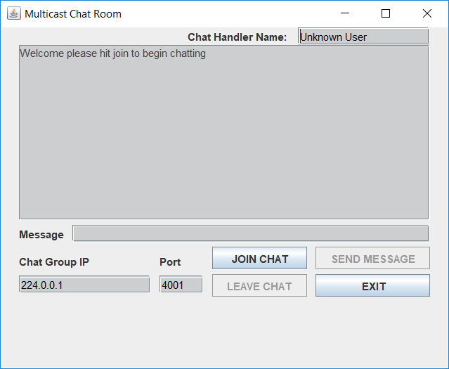
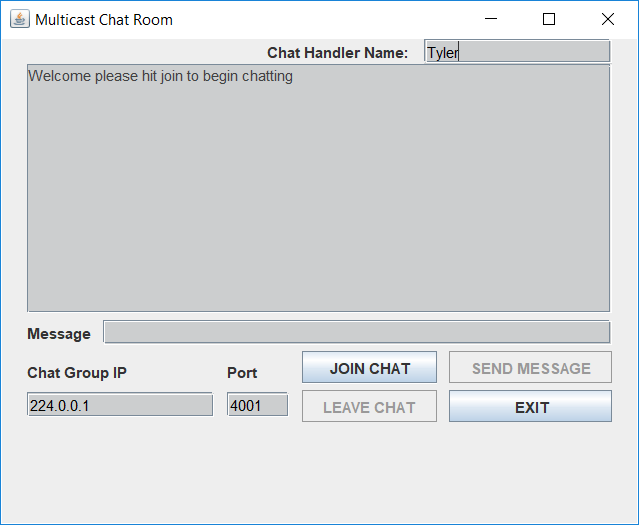
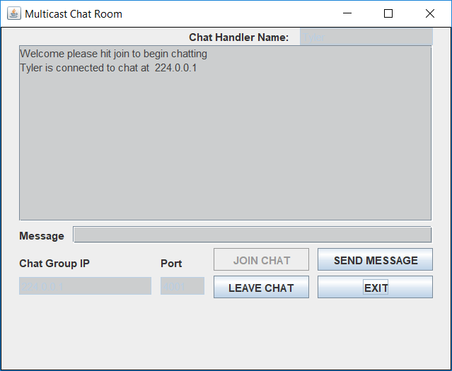
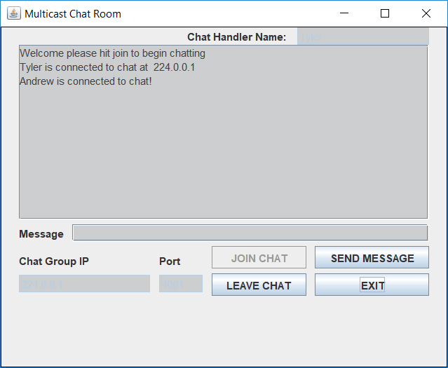
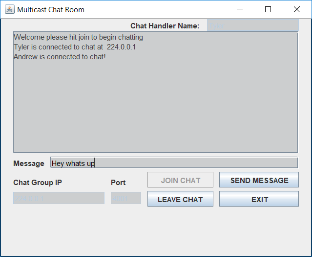
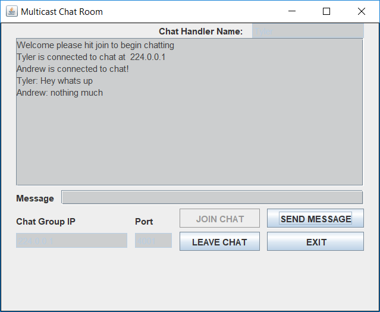

Multicast Chat System         
======================
This program implements java's multicast in order to transmit messages between
2 or more users. The default address used with this program is **224.0.0.1** 
and port **4001**. Of course these parameters can be changed in the GUI based
on the user's desire. Also, the user may supply any Avatar/Chat Username to be
used during the chat session.

# PURPOSE
This multicast chat system is useful for friends, co-workers, specialist, and
ect. This chat system can be used on any network that allows for the use of 
multicast. Multicast is used as a backbone of the internet as addresses 
**244.2.X.X** known as MBONE. If the chat is occuring in the local subnet it is
reccommended to use **244.0.0.1** for the address. This address is also the 
defualt adrress for the program. Also, if mobile devices are used it is 
reccommended to use address **244.0.0.11**.

# TUTORIAL
## Setup
When starting out your screen will display the defualt values for the port,
IP, and avatar name. The defualt port settings are **4001** and the defualt
IP is **244.0.0.1**. While for the avatar name just has the value of 
**Unknown User**.

It is reccommended that the avatar name is replaced with a descriptive name
that other users can recognize you by. Afterwards make sure your IP and port
are the ones you want to use and correspond to what you want to do. If these
addresses work for you then hit the button **Join Chat**.

## Joining Chat
Once you have hit the joined chat button you will be greeted with a notification
if the operation was successful. The notification should display *avatar name 
**is connected to chat at** address*

If another user joins the chat you will recieve a notification stating the avatar
has successfully connected to the chat and will recieve any messages posted in 
the chat room.

## Messages
In order to send a message type in your message in the box next to the tab
labeled *Message*. Once you have completed typing your message hit **ENTER**
or click **SEND MESSAGE** to send the message to all users connected to the
chat room.

All messages will show up in the message box located under the chat handler
name. Each message will contain the id of the user who sent it and this will
be visable on all users screens even those who sent the message.

# NOTES
* Please always change the name from Unknown User to the name you want to use

* In order to start sending messages make sure your address and port is right.
  Then hit join button and the program will allow you to start transmitting
  messages,
  
* Have fun!

# INFO 

*See GitHub:* https://github.com/tylerbro93/
